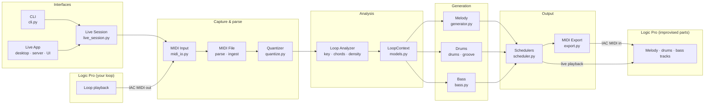
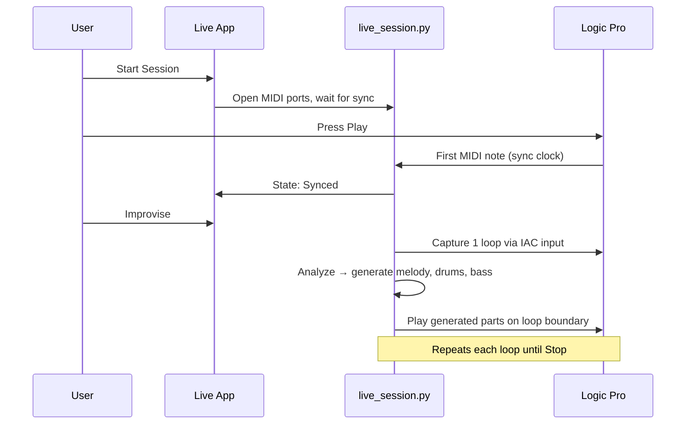

# The Logicians — System Architecture

AI-assisted live improvisation for Logic Pro.



## Pipeline (left to right)

| Stage | What happens |
|-------|----------------|
| **1. Input** | Logic plays your loop. MIDI is captured live (IAC bus) or read from a file. |
| **2. Quantize** | Raw notes are snapped to bars, beats, and symbolic positions. |
| **3. Analyze** | The system infers key, chord progression, bass roots, and rhythm density into a `LoopContext`. |
| **4. Generate** | Three generators run in parallel: melody, drums, and bass. |
| **5. Output** | Schedulers send MIDI back to Logic in time with your loop; optionally export to a `.mid` file. |

## Live performance flow



## Module map

```
the-logicians/
├── cli.py              Command-line entry (analyze, generate, live, serve)
├── desktop.py          Native app window (pywebview)
├── server.py           FastAPI backend for the live UI
├── live_session.py     Sync, capture, improvise state machine
├── midi_io.py          MIDI ports, live capture, file parsing
├── quantize.py         Symbolic quantization
├── analysis.py         Key, chords, density inference
├── generator.py        Rule-based melody generator
├── drums.py            Reactive drum variation
├── bass.py             Bass line generator
├── groove.py           Optional drum styles (Groove MIDI Dataset)
├── scheduler.py        Timed MIDI playback
└── export.py           Write melody to MIDI file
```

## Design note

The `MelodyGenerator` interface is swappable — the rule-based generator can later be replaced by a neural model without changing the MIDI capture, analysis, or scheduling pipeline.
